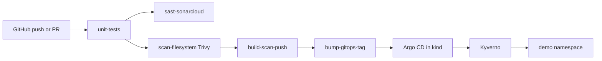

# DevSecOps x GitOps (app + CI)

Small Express CRUD API. The application is the payload for a GitHub Actions pipeline that tests, SAST-scans, container-scans, publishes to GHCR, then **bumps an image tag in a separate GitOps repo**. CI never talks to the cluster.

Companion repos:

- Config / desired state: [DevSecOps-x-GitOps-gitops](https://github.com/aboubakertounli/DevSecOps-x-GitOps-gitops)
- Portfolio case study: [portfolio](https://github.com/aboubakertounli/portfolio)

## What CI does



On a pull request the GitOps bump job is skipped (no image publish path that needs a tag write). SonarCloud and the GitOps bump still *appear* in the graph on `main`; they no-op with a log line until `SONAR_TOKEN` / `GITOPS_TOKEN` are set.

## Local run

```bash
npm ci
npm test
npm start
# http://127.0.0.1:8080/healthz
# http://127.0.0.1:8080/items
# http://127.0.0.1:8080/metrics
```

```bash
docker build -t ghcr.io/aboubakertounli/devsecops-x-gitops:local .
docker run --rm -p 8080:8080 ghcr.io/aboubakertounli/devsecops-x-gitops:local
```

## GitHub Actions secrets

Set these on this repository (`Settings → Secrets and variables → Actions`):

| Secret | Required for | How to create |
| --- | --- | --- |
| `SONAR_TOKEN` | `sast-sonarcloud` job | [SonarCloud](https://sonarcloud.io) → import this GitHub repo → account → generate token |
| `GITOPS_TOKEN` | `bump-gitops-tag` job | Fine-grained PAT: Contents **read/write** on `aboubakertounli/DevSecOps-x-GitOps-gitops` only |

`GITHUB_TOKEN` is enough to push images to GHCR. After the first successful `main` build, set the package visibility to **public** under GitHub → Packages so kind/Argo CD can pull without a pull secret.

## Watch the workflow graph

1. Open [Actions](https://github.com/aboubakertounli/DevSecOps-x-GitOps/actions)
2. Click the latest **ci** run
3. The job graph is the left-hand summary (boxes + arrows from `needs:`)

Until Argo CD runs on a local kind cluster, the pipeline stops at “new tag committed in the GitOps repo.”
