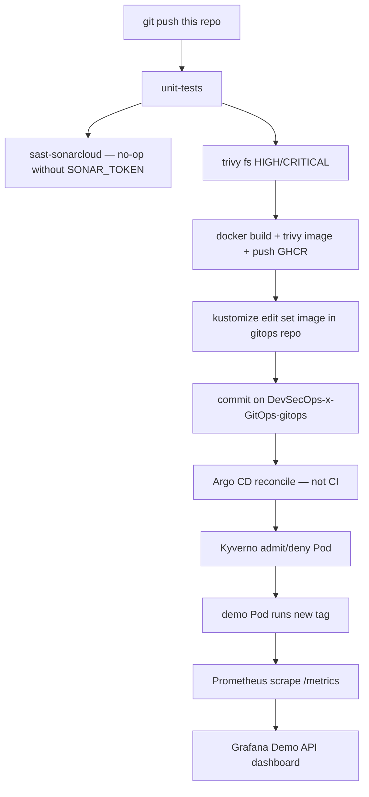

# DevSecOps x GitOps (app + CI)

Express CRUD API. After `git push`, this repo's GitHub Actions pipeline tests, scans, publishes an image to GHCR, then **commits a new tag in a second repo**. It never talks to Kubernetes.

- Desired state (Deployment, Prometheus, Grafana, Kyverno, Argo CD apps): [DevSecOps-x-GitOps-gitops](https://github.com/aboubakertounli/DevSecOps-x-GitOps-gitops)
- Portfolio: [portfolio](https://github.com/aboubakertounli/portfolio)

## After `git push` on `main`



The last four boxes are **in the cluster**, driven by git, not by a deploy job. `bump-gitops-tag` no-ops until `GITOPS_TOKEN` exists (fine-grained PAT, Contents read/write on `aboubakertounli/DevSecOps-x-GitOps-gitops` only). Set it under this repo → Settings → Secrets and variables → Actions.

PRs stop after the image scan. They do not push GHCR or touch GitOps.

## The metrics Prometheus actually scrapes

`GET /metrics` is Prometheus text. `prom-client` exports Node defaults plus:

- `http_requests_total{method,route,status}`
- `http_request_duration_seconds{method,route,status}`

On the cluster, scrape is **not** hardcoded to a hostname. `apps/demo/deployment.yaml` has:

```yaml
prometheus.io/scrape: "true"
prometheus.io/port: "8080"
prometheus.io/path: /metrics
```

Prometheus in `apps/observability` uses `kubernetes_sd_configs` (role: pod) and keeps only pods with that annotation.

## Local process (no cluster)

```bash
npm ci
npm test
npm start
# http://127.0.0.1:8080/healthz
# http://127.0.0.1:8080/metrics
```

## GitHub Actions secrets

| Secret | Job | Purpose |
| --- | --- | --- |
| `GITOPS_TOKEN` | `bump-gitops-tag` | Push the image tag to the GitOps repo |
| `SONAR_TOKEN` | `sast-sonarcloud` | Optional SAST |

`GITHUB_TOKEN` already pushes images to GHCR. The package must be **public** (GitHub → Packages → `devsecops-x-gitops` → Package settings) so kind can pull without a pull secret.
